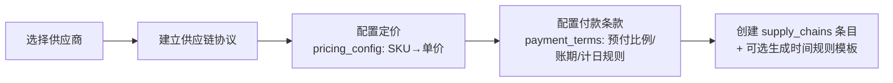
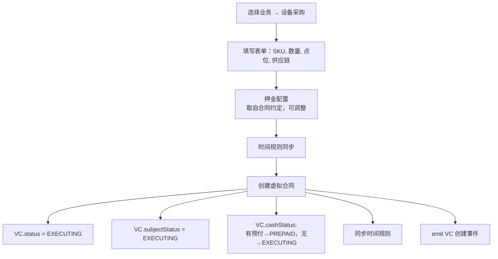
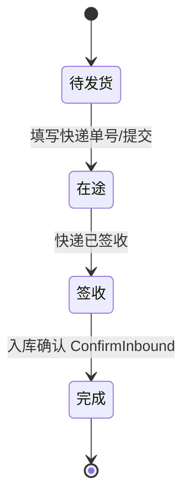
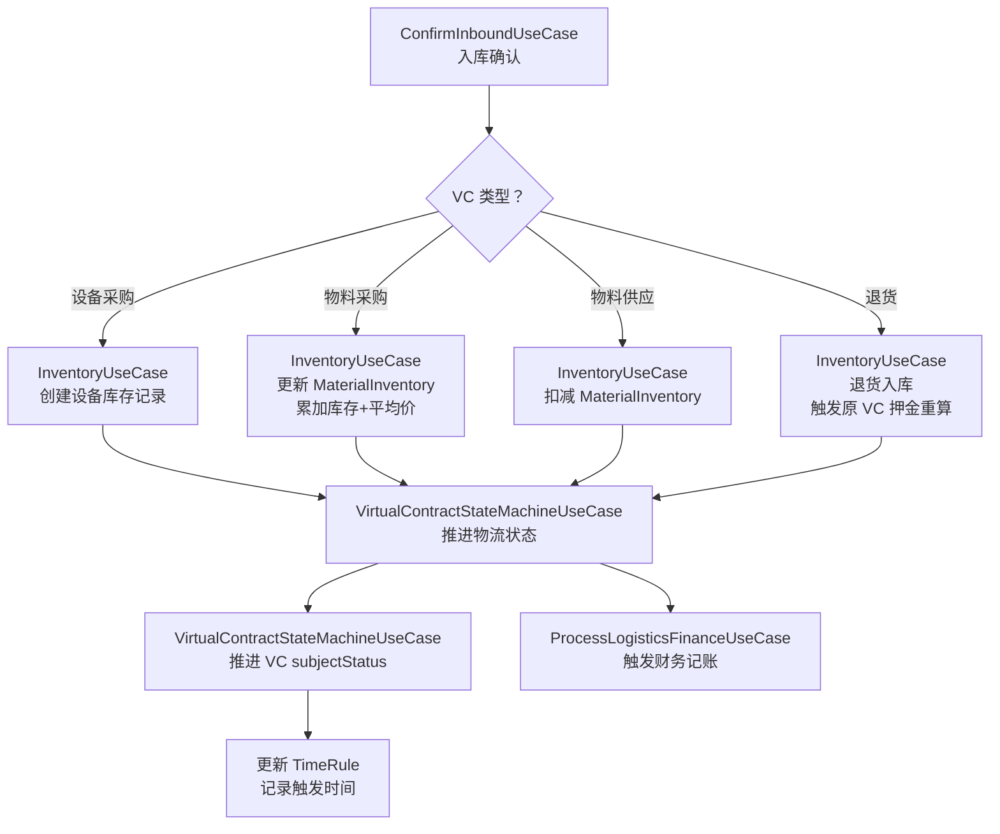
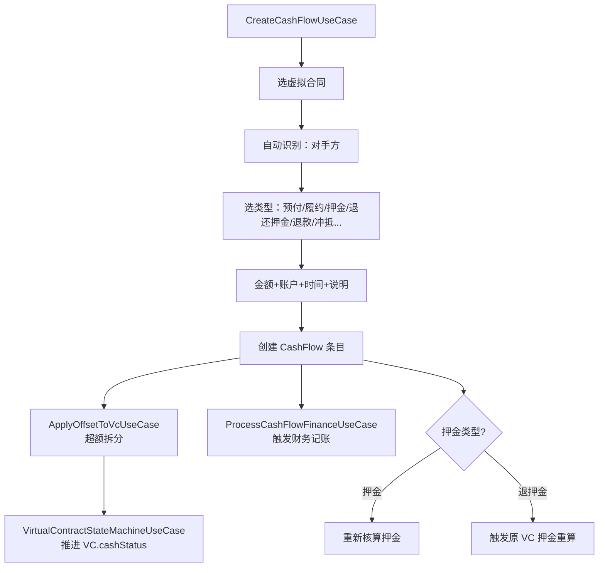

# Android 业务管理系统 — 整体 Workflow 说明

> 基于 `shanyin-android-v2/` 实际实现重写
> 核心业务逻辑与 Desktop 基本一致，以下为 Android 专属的差异说明

---

## 与 Desktop Workflow 的差异概览

| 差异维度 | Desktop | Android |
|---------|---------|---------|
| 状态联动触发方式 | `emit_event()` → `dispatch()` → `listener` | **UseCase 直接调用**（无事件总线） |
| VC 创建后规则同步 | `RuleManager.sync_from_parent()` | `SyncTimeRulesUseCase` 或类似 UseCase |
| 物流入库后联动 | `confirm_inbound_action()` 内调用三个模块 | `ConfirmInboundUseCase` 内调用三个 UseCase |
| 时间规则完成监听 | `time_rule_completion_listener` | 需在相关 UseCase 中手动调用 `updateTimeRuleResult()` |

---

## 目录

- [一、信息录入](#一信息录入)
- [二、业务管理](#二业务管理)
  - [2.1 客户导入流程（Business 状态机）](#21-客户导入流程business-状态机)
  - [2.2 供应链管理](#22-供应链管理)
- [三、业务开展](#三业务开展)
  - [3.1 设备采购](#31-设备采购)
  - [3.2 物料供应](#32-物料供应)
  - [3.3 物料采购](#33-物料采购)
  - [3.4 退货操作](#34-退货操作)
  - [3.5 库存拨付](#35-库存拨付)
- [四、具体运营](#四具体运营)
  - [4.1 物流管理](#41-物流管理)
  - [4.2 资金流管理](#42-资金流管理)
- [五、财务信息](#五财务信息)
- [六、内部模块](#六内部模块)
  - [6.1 时间规则引擎](#61-时间规则引擎)
  - [6.2 状态自动机](#62-状态自动机)
  - [6.3 财务模块](#63-财务模块)
  - [6.4 库存管理模块](#64-库存管理模块)
  - [6.5 押金管理模块](#65-押金管理模块)
  - [6.6 事件系统（Android 无）](#66-事件系统android-无)

---

## 一、信息录入

主页面含 6 个标签页，对应六大基础信息表：

| Tab 名称 | 对应表 | 功能 |
|---------|--------|------|
| 渠道客户 | `channel_customers` | 新建/维护客户信息 |
| 点位 | `points` | 新建/维护部署点位 |
| 供应商 | `suppliers` | 新建/维护设备/物料供应商 |
| SKU | `skus` | 新建/维护商品/设备规格 |
| 外部合作方 | `external_partners` | 新建/维护第三方合作方 |
| 银行账户 | `bank_accounts` | 新建/维护银行账户（供资金流使用） |

---

## 二、业务管理

### 2.1 客户导入流程（Business 状态机）

```mermaid
flowchart TD
    A[前期接洽] -->|推进| B[业务评估]
    B -->|推进| C[客户反馈]
    C -->|推进| D[合作落地]
    D -->|推进| E[业务开展]
    E <-..->|暂缓| F[业务暂缓]
    E -->|终止| Z1[业务终止]
    D -->|终止| Z2[业务终止]
    C -->|终止| Z3[业务终止]
    B -->|终止| Z4[业务终止]
    A -->|终止| Z5[业务终止]
    E -->|完成| Z6[业务完成]

    classDef stage fill:#e6f7ff,stroke:#1890ff;
    classDef end fill:#f6ffed,stroke:#52c41a;
    classDef pause fill:#fffbe6,stroke:#faad14;
    classDef cancel fill:#fff1f0,stroke:#f5222d;

    class A,B,C,D,E stage;
    class F pause;
    class Z1,Z2,Z3,Z4,Z5,Z6 cancel;
```

> **关键节点**：合作落地推进时，`AdvanceBusinessStageUseCase` 执行：
> 1. 创建 `contracts` 表条目
> 2. 调用 `GenerateTimeRulesFromPaymentTermsUseCase` 生成时间规则模板
> 3. 所有状态变更写入 `business.details.history`

---

### 2.2 供应链管理

供应链协议（`supply_chains`）是采购类 VC 的父级。



---

## 三、业务开展

| Tab | 对应操作 | 触发 |
|-----|---------|------|
| 业务列表 | 设备采购 / 物料供应 | 基于 business_id |
| 物料采购 | 设备采购(库存) / 物料采购 | 基于 supply_chain_id，不关联 business |
| 退货操作 | 退货 | 对"合同标=完成"的虚拟合同发起 |

---

### 3.1 设备采购



> Android 中事件通过 UseCase 直接调用传递，不使用 Desktop 的 `emit_event()` 事件总线

---

### 3.2 物料供应

库存充足性校验通过 `ValidateInventoryAvailabilityUseCase` 实现。

---

### 3.3 物料采购（补库存）

不关联业务，仅关联供应链。

---

### 3.4 退货操作

| 方向 | 存储值 | 含义 |
|------|--------|------|
| `CUSTOMER_TO_US` | `客户向我们退回` | 物料供应场景，客户退货 |
| `US_TO_SUPPLIER` | `我们向供应商退货` | 物料采购场景，我们退货给供应商 |

---

### 3.5 库存拨付

在仓库之间调拨设备，不涉及资金流。

---

## 四、具体运营

### 4.1 物流管理

#### 物流状态机



#### 关键流程：入库确认

`ConfirmInboundUseCase` 是三联动核心节点：



> ⚠️ Android 中无 `time_rule_completion_listener`，需在 `ConfirmInboundUseCase` 中手动调用规则完成更新

---

### 4.2 资金流管理



---

## 五、财务信息

两个 Tab：

| Tab | 内容 |
|-----|------|
| 自身运营账 | 资金划入/划出、内部转账 |
| 客户/供应商账本 | 按对手方分户明细 |

> Android 凭证备份机制与 Desktop 不同，Desktop 备份到 JSON 文件，Android 凭证信息存储在 `FinancialJournalEntity.voucher_path` 字段。

---

## 六、内部模块

### 6.1 时间规则引擎

Android 的时间规则引擎与 Desktop 逻辑基本一致，但实现为 Kotlin 类：

| Desktop | Android |
|---------|---------|
| `logic/time_rules/engine.py` | `domain/usecase/rule_engine/RuleEngine.kt` |
| `logic/time_rules/evaluator.py` | `domain/usecase/rule_engine/RuleEvaluator.kt` |
| `logic/time_rules/event_handler.py` | `domain/usecase/rule_engine/RunTimeRuleEngineUseCase.kt` |

---

### 6.2 状态自动机

Android 的 VC 状态机集中在一个 UseCase 中：

| Desktop | Android |
|---------|---------|
| `logic/state_machine.py` | `VirtualContractStateMachineUseCase.kt` |

```kotlin
// 物流状态变更 → VC subjectStatus
onLogisticsStatusChanged(vcId, logisticsStatus)

// 资金流变更 → VC cashStatus 重算
onCashFlowChanged(vcId)
```

---

### 6.3 财务模块

| Desktop | Android |
|---------|---------|
| `logic/finance/engine.py::process_logistics_finance` | `ProcessLogisticsFinanceUseCase` |
| `logic/finance/engine.py::process_cash_flow_finance` | `ProcessCashFlowFinanceUseCase` |
| `logic/offset_manager.py` | `OffsetPoolUseCase` + `ApplyOffsetToVcUseCase` |

---

### 6.4 库存管理模块

| Desktop | Android |
|---------|---------|
| `logic/inventory.py` | `InventoryUseCases.kt` |

---

### 6.5 押金管理模块

Android 中押金逻辑内嵌于 `VirtualContractStateMachineUseCase` 中，通过 `onCashFlowChanged()` 调用，不单独拆分为模块。

---

### 6.6 事件系统（Android 无）

| Desktop | Android |
|---------|---------|
| `logic/events/dispatcher.py::emit_event` | **不存在** |
| `logic/events/listeners.py::register_listener` | **不存在** |
| `logic/events/responders.py` | **不存在** |

**Android 的替代实现方式：**

Desktop 中通过事件总线实现的联动，在 Android 中通过 UseCase 直接调用实现：

```kotlin
// Desktop 方式
confirm_inbound_action() → emit_event() → listener → finance_module()

// Android 方式（无事件总线，直接调用）
ConfirmInboundUseCase {
    inventoryUseCase.doSomething()
    virtualContractStateMachineUseCase.onLogisticsChanged()
    processLogisticsFinanceUseCase.process()
    // 手动更新 TimeRule
    runTimeRuleEngineUseCase.updateRuleResult()
}
```

---

## 附录：VC.type 存储值与中文对照

| VC.type 存储值 | 含义 | 资金方向 |
|---------------|------|---------|
| `设备采购` | 设备采购（关联业务） | Customer→我们→Supplier |
| `设备采购(库存)` | 设备采购（不关联业务） | 我们→Supplier |
| `库存拨付` | 仓库间调拨 | 无 |
| `物料采购` | 物料采购 | 我们→Supplier |
| `物料供应` | 向客户供应物料 | Customer→我们 |
| `退货` | 退货执行单 | 反向 |

---

## 附录：Android 与 Desktop 枚举命名对照

| 概念 | Desktop 存储值 | Android 枚举值 |
|------|-------------|--------------|
| VC 执行中 | `执行` | `VCStatus.EXECUTING` |
| VC 完成 | `完成` | `VCStatus.COMPLETED` |
| VC 终止 | `终止` | `VCStatus.TERMINATED` |
| 标的完成 | `完成` | `SubjectStatus.COMPLETED` |
| 资金完成 | `完成` | `CashStatus.COMPLETED` |
| 物流在途 | `在途` | `LogisticsStatus.IN_TRANSIT` |
| 物流签收 | `签收` | `LogisticsStatus.SIGNED` |
| 物流完成 | `完成` | `LogisticsStatus.COMPLETED` |

> Android 枚举内置 `fromDbName()` 方法，自动将数据库中存储的中文字符串映射为 Kotlin 枚举值
