# Desktop 业务管理系统 — 整体 Workflow 说明

> 基于 `business_system.db` 实际实现重写
> 数据库：[database.md](database.md) ｜ 模块文档：[docs/desktop_docs/models/](desktop_docs/models/)

---

## 目录

- [一、信息录入](#一信息录入)
- [二、业务管理](#二业务管理)
  - [2.1 客户导入流程（Business 状态机）](#21-客户导入流程business-状态机)
  - [2.2 附加业务政策](#22-附加业务政策addon-business)
  - [2.3 供应链管理](#23-供应链管理)
- [三、业务开展](#三业务开展)
  - [3.1 设备采购](#31-设备采购)
  - [3.2 物料供应](#32-物料供应)
  - [3.3 物料采购](#33-物料采购)
  - [3.4 退货操作](#34-退货操作)
  - [3.5 库存拨付](#35-库存拨付)
- [四、具体运营](#四具体运营)
  - [4.1 物流管理](#41-物流管理)
  - [4.2 资金流管理](#42-资金流管理)
- [五、财务信息](#五财务信息)
- [六、内部模块](#六内部模块)
  - [6.1 时间规则引擎](#61-时间规则引擎)
  - [6.2 状态自动机](#62-状态自动机)
  - [6.3 财务模块](#63-财务模块)
  - [6.4 库存管理模块](#64-库存管理模块)
  - [6.5 押金管理模块](#65-押金管理模块)
  - [6.6 事件系统](#66-事件系统)
  - [6.7 操作事务与回滚](#67-操作事务与回滚)
- [七、VC 三状态机详解](#七vc-三状态机详解)

---

## 一、信息录入

主页面含 6 个标签页，对应六大基础信息表（主数据）：

| Tab 名称 | 对应表 | 功能 |
|---------|--------|------|
| 渠道客户 | `channel_customers` | 新建/维护客户信息 |
| 点位 | `points` | 新建/维护部署点位 |
| 供应商 | `suppliers` | 新建/维护设备/物料供应商 |
| SKU | `skus` | 新建/维护商品/设备规格 |
| 外部合作方 | `external_partners` | 新建/维护第三方合作方 |
| 银行账户 | `bank_accounts` | 新建/维护银行账户（供资金流使用） |

> 所有主数据支持 CRUD 操作，创建时发送 `MASTER_CREATED` 事件。

---

## 二、业务管理

### 2.1 客户导入流程（Business 状态机）

客户签约前经历 **6 个阶段**，形成线性流程，支持「推进」与「取消」两条路径。

```mermaid
flowchart TD
    A[前期接洽] -->|推进| B[业务评估]
    B -->|推进| C[客户反馈]
    C -->|推进| D[合作落地]
    D -->|推进| E[业务开展]
    E <-..->|暂缓| F[业务暂缓]
    E -->|终止| Z1[业务终止]
    D -->|终止| Z2[业务终止]
    C -->|终止| Z3[业务终止]
    B -->|终止| Z4[业务终止]
    A -->|终止| Z5[业务终止]
    E -->|完成| Z6[业务完成]

    classDef stage fill:#e6f7ff,stroke:#1890ff;
    classDef end fill:#f6ffed,stroke:#52c41a;
    classDef pause fill:#fffbe6,stroke:#faad14;
    classDef cancel fill:#fff1f0,stroke:#f5222d;

    class A,B,C,D,E stage;
    class F pause;
    class Z1,Z2,Z3,Z4,Z5,Z6 cancel;
```

#### 阶段推进详情

| 当前阶段 | 操作 | 行为 |
|---------|------|------|
| 前期接洽 | 推进 | 录入接洽说明 → 进入`业务评估` |
|           | 取消 | 录入原因 → 进入`业务终止` |
| 业务评估 | 推进 | 录入评估结果 → 进入`客户反馈` |
|           | 取消 | 录入原因 → 进入`业务终止` |
| 客户反馈 | 推进 | 录入反馈结果 → 进入`合作落地` |
|           | 取消 | 录入原因 → 进入`业务终止` |
| **合作落地** | **推进** | **创建 Contract + 生成付款条款时间规则 → 进入`业务开展`** |
|             | 取消 | 录入原因 → 进入`业务终止` |
| 业务开展 | 暂缓 | 进入`业务暂缓`（可恢复） |
|           | 终止 | 进入`业务终止` |
|           | 完成 | 进入`业务完成` |

> **关键节点**：合作落地推进时，`advance_business_stage_action()` 执行：
> 1. 创建 `contracts` 表条目
> 2. 调用 `RuleManager.generate_rules_from_payment_terms()` 生成时间规则模板
> 3. 所有状态变更写入 `business.details.history`

### 2.2 附加业务政策（Addon Business）

业务进入 ACTIVE 阶段后，可对特定 SKU 添加附加业务政策（原子化）：

| addon_type | 说明 | 约束 |
|------------|------|------|
| `PRICE_ADJUST` | 价格调整 | SKU 已存在于业务定价配置中 |
| `NEW_SKU` | 新增 SKU 到业务 | SKU 尚不存在于业务中 |

- 有效期可设置（开始/结束时间），支持永久有效（end_date=NULL）
- 同业务 + 同 SKU 下不允许时间重叠
- 附加业务通过 `addon_business` 模块管理，创建/更新/失效均有对应 Action

---

### 2.3 供应链管理

#### 2.2.1 建立供应链关系

供应链协议（`supply_chains`）是采购类 VC 的父级，用于配置定价和付款条款。

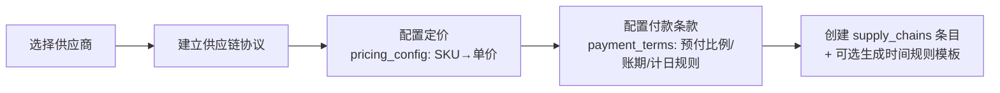

#### 2.2.2 供应链更新与终止

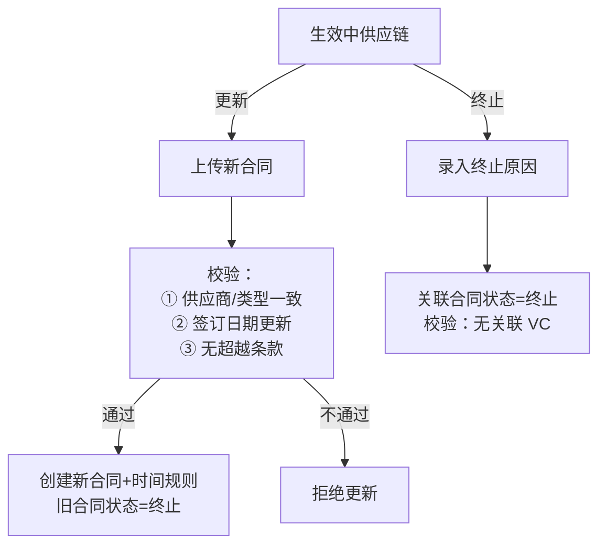

> ⚠️ 删除供应链前必须确认无关联 VC（`virtual_contracts.supply_chain_id`）

---

## 三、业务开展

客户签约完成后，业务进入"业务开展"阶段，可以发起以下操作：

| Tab | 对应操作 | 触发 |
|-----|---------|------|
| 业务列表 | 设备采购 / 物料供应 | 基于 business_id |
| 物料采购 | 设备采购(库存) / 物料采购 | 基于 supply_chain_id，不关联 business |
| 退货操作 | 退货 | 对"合同标=完成"的虚拟合同发起 |

---

### 3.1 设备采购

从业务发起，采购设备投向客户点位。涉及资金流（预付/履约）和押金。

```mermaid
flowchart TB
    P[选择业务 → 设备采购] --> F[填写表单：<br/>SKU, 数量, 点位, 供应链]
    F --> C[押金配置<br/>取自合同约定，可调整]
    C --> T[时间规则<br/>从父级 Business/SC 同步]
    T --> V[创建虚拟合同]

    V --> V1[VC.status = 执行]
    V --> V2[VC.subject_status = 执行]
    V --> V3[VC.cash_status:<br/>有预付→预付，无→执行]
    V --> V4[RuleManager.sync_from_parent<br/>同步时间规则]
    V --> V5[apply_offset_to_vc<br/>应用偏移量]
    V --> V6[emit_event(VC_CREATED)]
```

> VC 类型存储值：`设备采购`
> 资金流方向：Customer → 我们（押金）+ 我们 → Supplier（货款）

---

### 3.2 物料供应

从业务发起，向客户供应物料。库存必须充足才能创建。

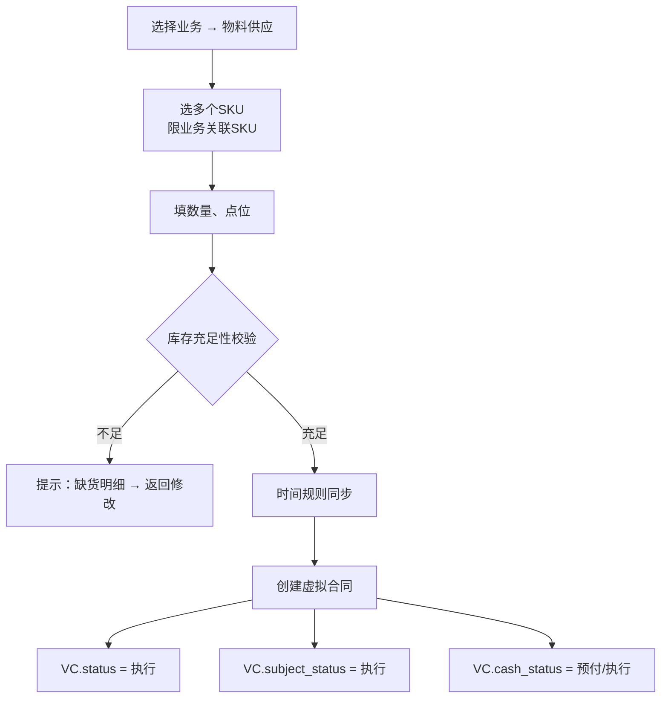

> VC 类型存储值：`物料供应`
> 资金流方向：Customer → 我们（预收/履约）

---

### 3.3 物料采购（补库存）

不关联业务，仅关联供应链，用于补充自有库存。

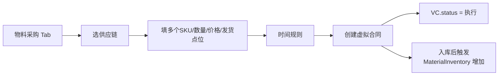

> VC 类型存储值：`物料采购`
> 资金流方向：我们 → Supplier（预付/应付）

---

### 3.4 退货操作

#### 触发条件

- 仅对 **VC.subject_status = 完成** 的虚拟合同

#### 退货方向

| 方向 | 存储值 | 含义 |
|------|--------|------|
| `CUSTOMER_TO_US` | `客户向我们退回` | 物料供应场景，客户退货给我们 |
| `US_TO_SUPPLIER` | `我们向供应商退货` | 物料采购场景，我们退货给供应商 |

```mermaid
flowchart TB
    R[退货 Tab] --> List[列出可退 VC<br/>subject_status=完成]
    List --> Btn[点击"退货"]
    Btn --> Dir{退货方向}
    Dir -->|客户退回| F1[从客户仓收退货]
    Dir -->|向供应商退| F2[退货到供应商仓]

    F1 & F2 --> Form[填退货信息：<br/>SKU/数量/退款金额/说明]
    Form --> Sub[提交]

    Sub --> NewVC[创建退货 VC]
    NewVC --> N1[VC.status = 执行]
    NewVC --> N2[related_vc_id = 原VC]
    NewVC --> N3[return_direction 记录方向]
    NewVC --> N4[根据退款金额判断<br/>cash_status]
    NewVC --> N5[冻结库存：SN锁定<br/>或仓分布扣减]
```

> VC 类型存储值：`退货`
> 退货 VC 的 cash_flow 资金流方向与正向相反

---

### 3.5 库存拨付

在仓库之间调拨设备，不涉及资金流。


> VC 类型存储值：`库存拨付`

---

## 四、具体运营

### 4.1 物流管理

#### 物流状态机

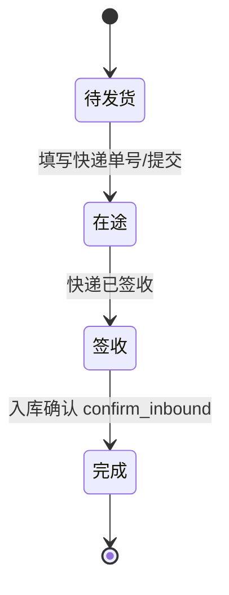

#### 关键流程：入库确认（confirm_inbound_action）

入库确认是系统的 **三联动核心节点**：

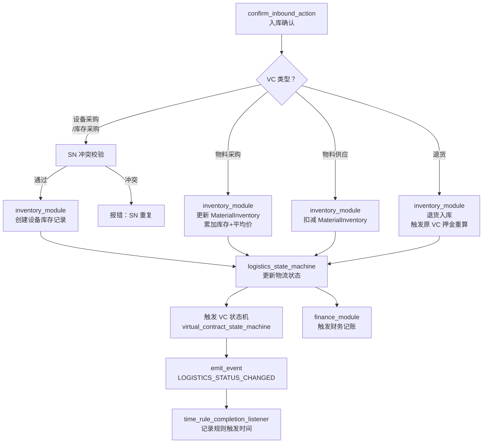

> **防重机制**：`logistics.finance_triggered = True` 后，`finance_module` 不会重复执行

#### 物流 → VC 状态机联动

| 快递单状态 | 物流主单状态 | VC.subject_status 更新 |
|-----------|------------|---------------------|
| 存在 TRANSIT | 在途 | 执行 |
| 全部 SIGNED | 签收 | 签收 |
| 全部 FINISH | 完成 | **完成** |

---

### 4.2 资金流管理

#### 新建资金流流程

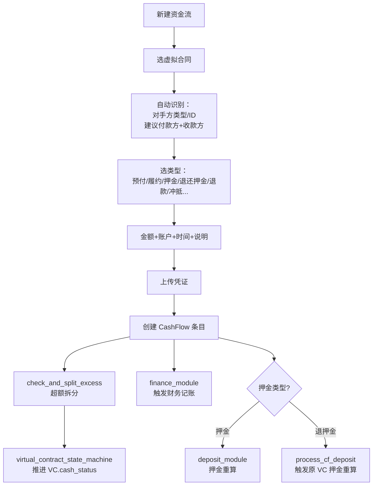

#### 资金流类型与记账方向

| 类型 | 资金方向 | 借方 | 贷方 |
|------|---------|------|------|
| 预付（对我们） | Customer → 我们 | CASH | PRE_COLLECTION |
| 履约（对我们） | Customer → 我们 | CASH | REVENUE |
| 押金收取 | Customer → 我们 | CASH | DEPOSIT_PAYABLE |
| 预付（对供应商） | 我们 → Supplier | PREPAYMENT | CASH |
| 履约（对供应商） | 我们 → Supplier | COST/AP | CASH |
| 退款 | 反向 | CASH | AR/AP |
| 冲抵 | 池内抵消 | PRE_COLLECTION/PREPAYMENT | CASH |

---

## 五、财务信息

两个 Tab：

| Tab | 内容 |
|-----|------|
| 自身运营账 | 资金划入/划出、内部转账 |
| 客户/供应商账本 | 按对手方分户明细（FinanceAccount.level2_name） |

#### 凭证文件备份

所有记账凭证在写入 `financial_journal` 同时备份到 JSON：
- 路径：`data/finance/finance-voucher/{year}/{month}/{voucher_no}.json`

---

## 六、内部模块

### 6.1 时间规则引擎

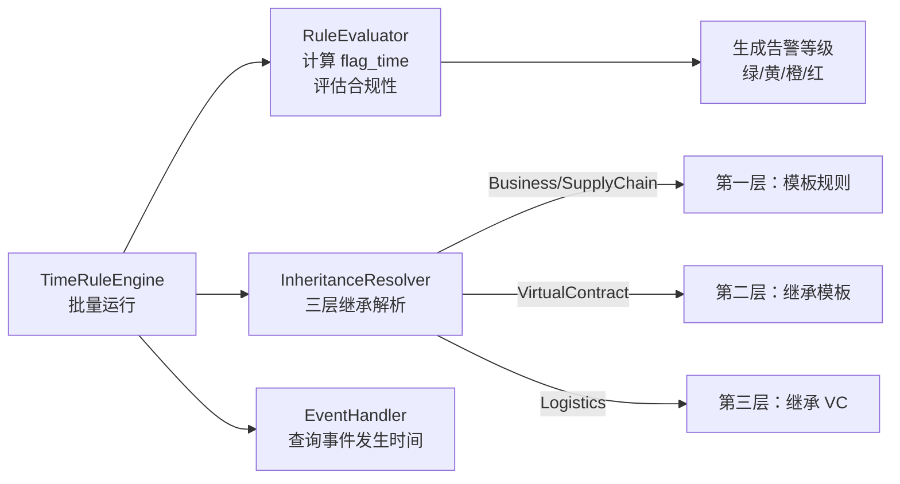

#### flag_time 计算

```
flag_time = trigger_event_time + offset + unit
```

#### 合规判断

| direction | 合规条件 |
|-----------|---------|
| `before` | target_time ≤ flag_time |
| `after` | target_time ≥ flag_time |

#### 告警阈值（direction=before 时）

| 等级 | 条件 |
|------|------|
| 绿色 | 距标杆时间 > 7 天 |
| 黄色 | 3-7 天 |
| 橙色 | 1-3 天 |
| 红色 | ≤ 0 天（超时） |

---

### 6.2 状态自动机

#### （1）物流单状态机（state_machine.py）

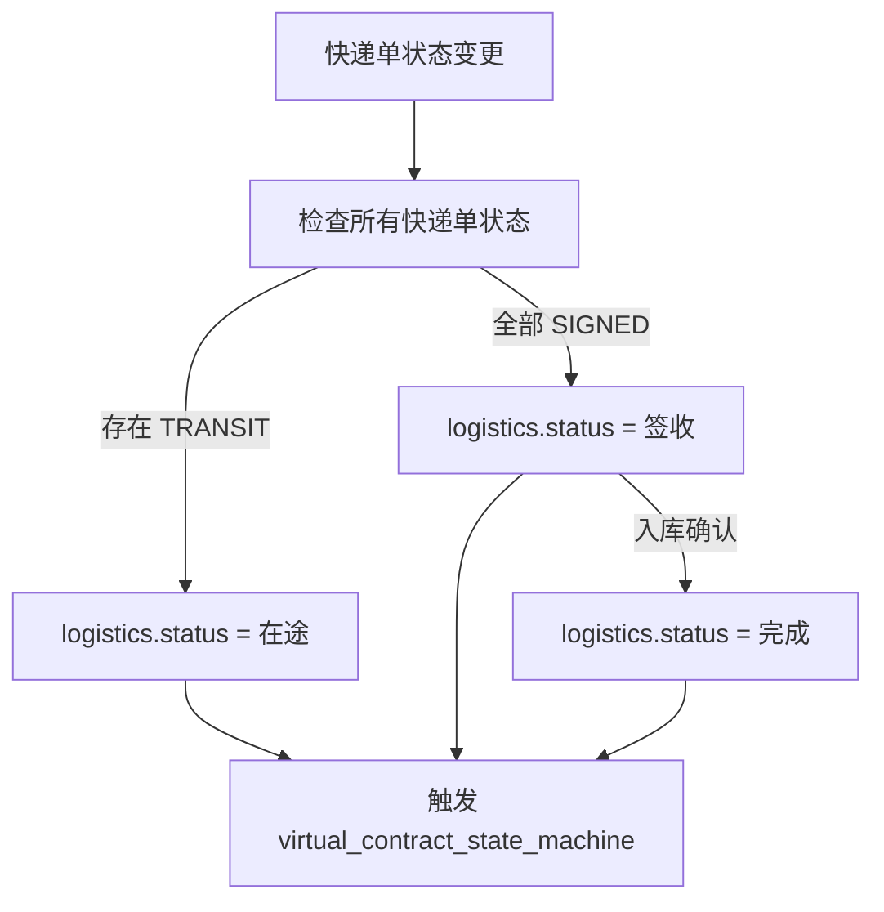

#### （2）VC 状态机（三套独立状态）

| 状态机 | 触发源 | 终态 |
|--------|--------|------|
| VC.status | subject_status=完成 + cash_status=完成 | 完成/终止/取消 |
| VC.subject_status | 物流状态推进 | 执行→发货→签收→完成 |
| VC.cash_status | 资金流录入 + 押金重算 | 执行→预付→完成 |

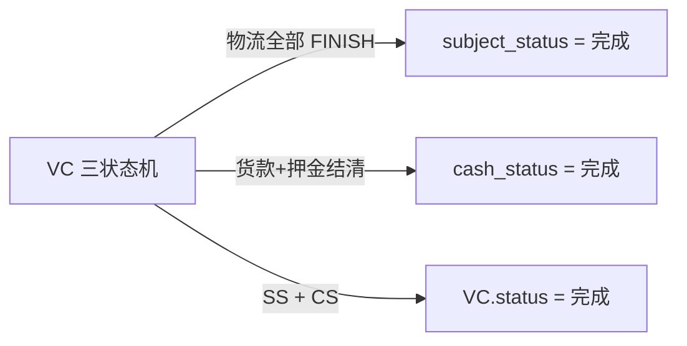

---

### 6.3 财务模块

`finance_module(logistics_id)` / `finance_module(cash_flow_id)` 是唯二的财务触发入口。

| 触发源 | 处理 |
|--------|------|
| `process_logistics_finance` | 物流入库确认：采购入库→存货↑+应付↑；供应出库→应收↑+收入↑；退货反向 |
| `process_cash_flow_finance` | 资金流录入：收付款核销、押金、预收预付 |

---

### 6.4 库存管理模块

```
inventory_module(logistics_id)
├── EQUIPMENT_PROCUREMENT / STOCK_PROCUREMENT
│   └── 创建 EquipmentInventory（SN 唯一性校验）
│       └── deposit_module() 押金核算
├── MATERIAL_PROCUREMENT
│   └── 更新 MaterialInventory：累加 stock_distribution + 重新计算 average_price
├── MATERIAL_SUPPLY
│   └── 更新 MaterialInventory：扣减 stock_distribution
└── RETURN
    └── 设备：更新 point_id + operational_status
    └── 物料：累加 stock_distribution
    └── 触发原 VC 押金重算
```

---

### 6.5 押金管理模块

双触发路径：

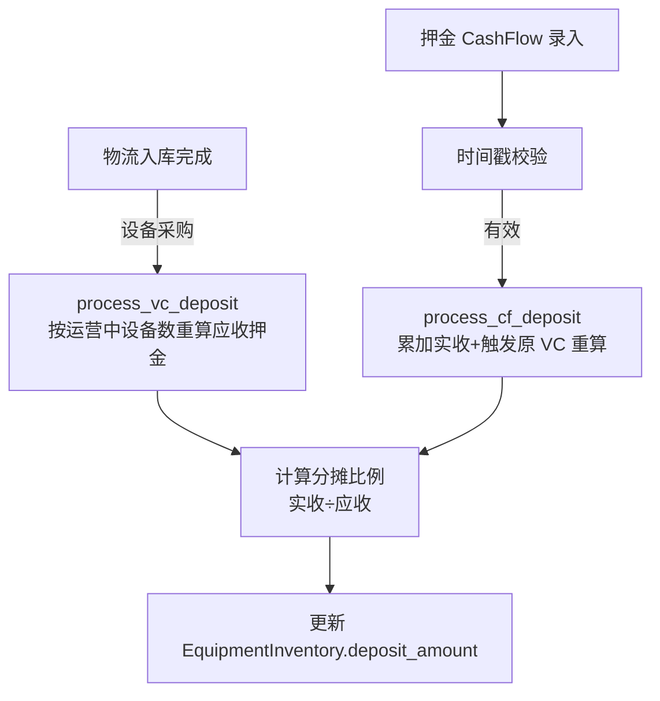

---

### 6.6 事件系统

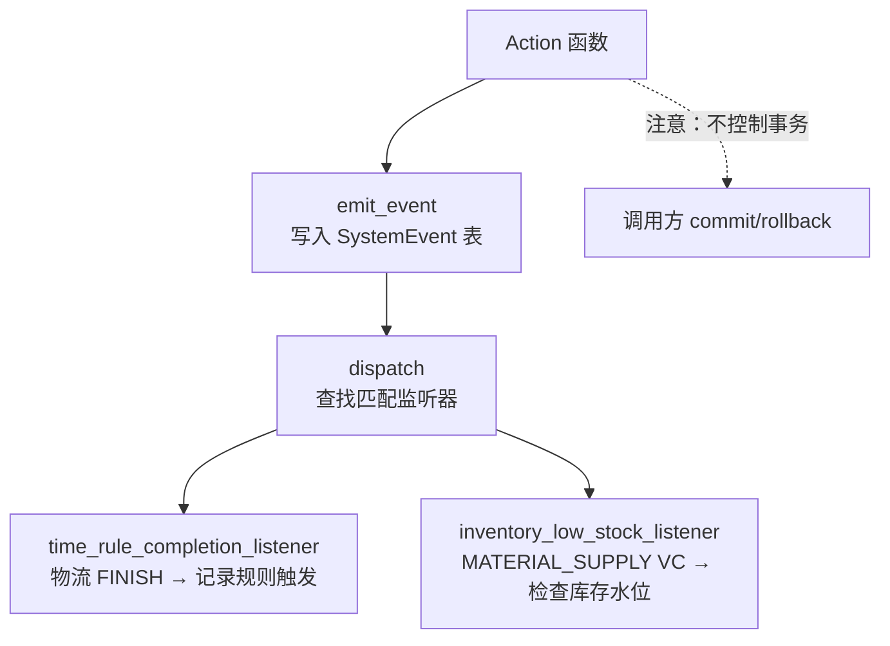

---

### 6.7 操作事务与回滚

所有 Action 在执行成功后会创建 `operation_transactions` 记录，存储 `snapshot_before`（修改前快照）和 `snapshot_after`（修改后快照），支持幂等回滚/撤销回滚。

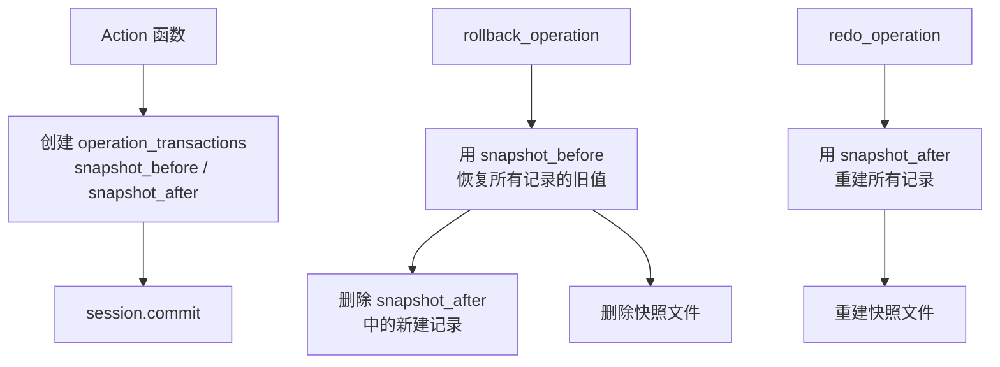

**约束：**
- FINISH 状态的 VC 禁止回滚
- 已 failed 的操作不允许回滚
- 已 rolled_back 的操作不允许重复回滚

---

## 七、VC 三状态机详解

VC 的三套状态机互相独立又联动推进：

### 7.1 三状态定义

| 状态机 | 状态值 | 流转方向 |
|--------|--------|---------|
| `VC.status` | 执行 → 完成 / 终止 / 取消 | EXE → FINISH/TERMINATED/CANCELLED |
| `VC.subject_status` | 执行 → 发货 → 签收 → 完成 | EXE → SHIPPED → SIGNED → FINISH |
| `VC.cash_status` | 执行 → 预付 → 完成 | EXE → PREPAID → FINISH |

### 7.1 联动规则

```mermaid
flowchart TD
    subgraph 触发源
        L[物流入库确认] --> SM[subject_status 推进]
        CF[资金流录入] --> CM[cash_status 推进]
    end

    SM -->|全部物流 FINISH| SS_FIN[subject_status = 完成]
    CM -->|货款+押金到账| CS_FIN[cash_status = 完成]

    SS_FIN & CS_FIN --> Overall[VC.status = 完成<br/>emit_event(VC_STATUS_TRANSITION)]
```

### 7.2 退货 VC 特殊处理

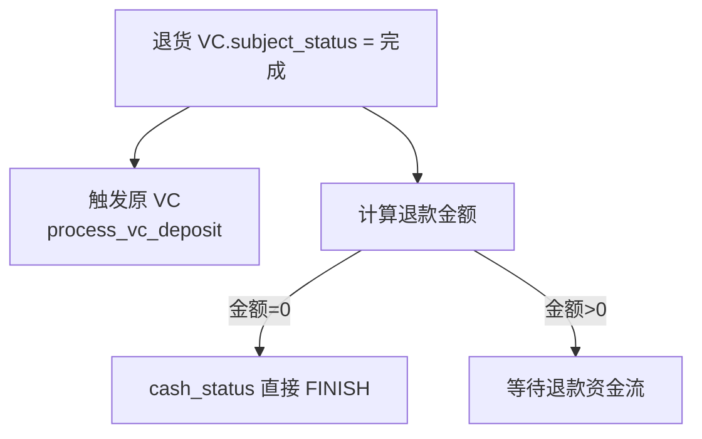

---

## 附录：VC.type 存储值与中文对照

| VC.type 存储值 | 含义 | 资金方向 |
|---------------|------|---------|
| `设备采购` | 设备采购（关联业务） | Customer→我们→Supplier |
| `设备采购(库存)` | 设备采购（不关联业务） | 我们→Supplier |
| `库存拨付` | 仓库间调拨 | 无 |
| `物料采购` | 物料采购 | 我们→Supplier |
| `物料供应` | 向客户供应物料 | Customer→我们 |
| `退货` | 退货执行单 | 反向 |
