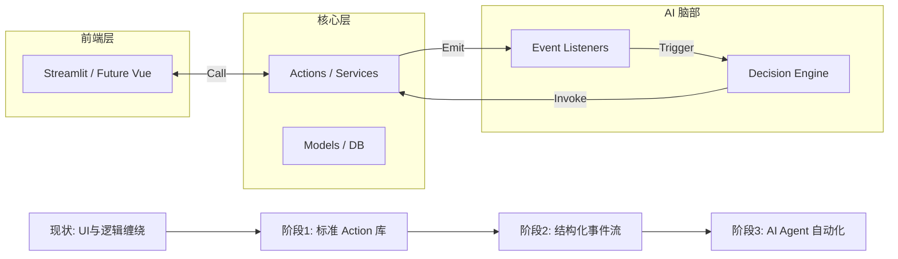

# 🗺️ 闪饮业务管理系统：架构升级总路线图 (2026)

## 0. 背景与目标
针对“闪饮-v2”系统目前业务逻辑与 UI 深度耦合的问题，本路线图旨在通过**渐进式重构**，在不中断业务的前提下，实现逻辑内核化、操作标准化与事件流化，为未来 10-20 人规模的稳定运行及 **AI Agent** 的全面接入打下坚实基础。

### 核心指标
- **解耦度**：UI 代码中不含 `SQLAlchemy` 直接调用，逻辑层中不含 `streamlit` 或 `session_state` 调用。
- **AI 友好度**：核心业务功能具备标准化输入输出（Action 接口），系统变动具备可回溯事件流（Event Stream）。
- **稳定性**：通过自动化 Action 测试覆盖 90% 以上的财务与状态机转换逻辑。

---

## 📅 阶段划分与里程碑

### 阶段一：内核重构——从“UI 驱动”转向“Action 模式”
**重点**：将散落在 `ui/` 下的业务保存、校验、计算逻辑向 `logic/actions` 迁移。
- **关键交付物**：`logic/actions` 目录库、Action 标准输入 Pydantic 模型。
- **预期成果**：你可以不打开浏览器，仅通过写 Python 脚本就能创建一个 VC 或处理一个退货单。

### 阶段二：感知增强——建立标准事件流与审计链
**重点**：在业务动作执行的关键节点发布“领域事件”，变“数据记录”为“事实流”。
- **关键交付物**：`SystemEvent` 数据库模型、事件分发器、事件溯源看板。
- **预期成果**：系统具备了完整的“记忆”，AI 可以通过订阅事件发现业务瓶颈（如频繁超时、高退货率）。

### 阶段三：AI 就绪——接入智能体（Agent）管理能力
**重点**：利用前两阶段形成的 Action（机械臂）和 Event（传感器），实现 AI 闭环管理。
- **关键交付物**：AI 专用 Context 服务、Agent 工具调用接口（Tool Use）。
- **预期成果**：AI 能够根据时间规则产生的警告事件，自动拟定处理方案并调用 Action 执行，实现“半自动化运营”。

---

## 📈 演进方向图示

---

## 📂 详细方案索引
- [阶段一：内核重构与 Action 模式实施方案](./stage1_core_logic_refactor.md)
- [阶段二：事件驱动架构与事实流落地指南](./stage2_event_driven_architecture.md)
- [阶段三：AI Agent 编排与智能决策接入](./stage3_ai_agent_orchestration.md)
