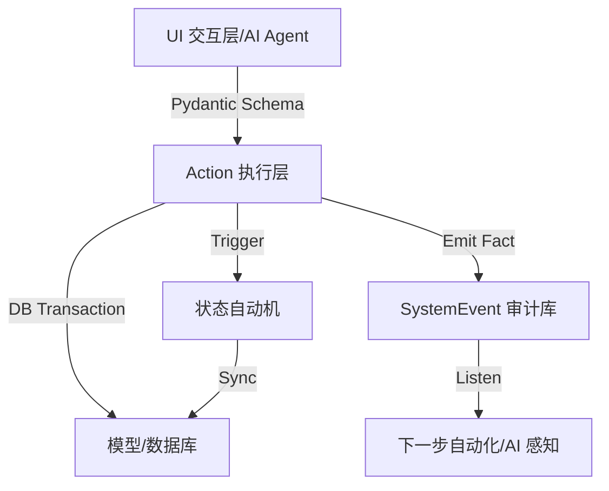

# 📑 闪饮业务管理系统：业务逻辑详细说明书 (V2.1)

> **版本：** 2026-01-04  
> **更新要点：** 全量 Actions 内核化、UI 与逻辑深度解耦、领域事件溯源 (Event Sourcing)  
> **状态：** 阶段一重构完结，系统已进入“AI 先行”架构

---

## 目录
1. [一、 系统架构总览](#一-系统架构总览)
2. [二、 核心实体与数据结构](#二-核心实体与数据结构)
3. [三、 指令化架构：Action 模式](#三-指令化架构action-模式)
4. [四、 业务准入与供应链管理 (Actions)](#四-业务准入与供应链管理)
5. [五、 业务开展与执行 (Actions)](#五-业务开展与执行)
6. [六、 运营驱动 (物流与状态机)](#六-运营驱动)
7. [七、 核心内部逻辑模块](#七-核心内部逻辑模块)
    - [7.1 财务模块 (Finance)](#71-财务模块-finance)
    - [7.2 押金管理模块 (Deposit)](#72-押金管理模块-deposit)
    - [7.3 库存管理模块 (Inventory)](#73-库存管理模块-inventory)
    - [7.4 时间规则引擎 (Time Engine)](#74-时间规则引擎-time-engine)
8. [八、 事件溯源与审计 (Event Sourcing)](#八-事件溯源与审计)

---

## 一、 系统架构总览

系统已从“UI 驱动”全面演进为 **“内核驱动 (Action-based Kernel)”** 架构。UI 层（Streamlit）仅作为用户交互的薄客户端，核心业务逻辑被封装在独立的 Actions 库中。

### 核心工作流逻辑图：

---

## 二、 核心实体与数据结构

系统数据模型（`models.py`）新增了“审计层”：

1.  **基础元数据层**：`ChannelCustomer`, `Supplier`, `Point`, `SKU`, `BankAccount`。
2.  **合约管理层**：`Contract`, `SupplyChain`, `Business`。
3.  **行动执行层**：`VirtualContract` (核心原子), `Logistics`, `CashFlow`。
4.  **财务审计层**：`FinancialJournal` (分录), `SystemEvent` (**领域事件事实记录**)。

---

## 三、 指令化架构：Action 模式

这是 V2.1 版本最核心的改变。所有业务变更动作都必须通过 `logic/actions` 目录下的函数完成。

### 3.1 核心原则
*   **契约化**：每个 Action 接受严格的 Pydantic Schema 输入（`logic/actions/schema.py`）。
*   **原子性**：Actions 包裹在单个数据库事务中，`commit/rollback` 对 UI 透明。
*   **不可逆记录**：每次 Action 成功后，自动向 `SystemEvent` 表写入一条 JSON 格式的事实记录。

### 3.2 核心 Action 矩阵
| 模块 | 核心 Action 文件 | 职能 |
| :--- | :--- | :--- |
| **主数据** | `master_actions.py` | 客户、点位、SKU、账户的标准化增删改查。 |
| **业务流** | `business_actions.py` | 业务导入、全阶段自动化推进、时间规则自动派生。 |
| **供应链** | `supply_chain_actions.py` | 供应商协议建立、定价绑定、规则同步。 |
| **执行单** | `vc_actions.py` | 各类 VC（采购/供应/退货）创建、底层数据安全修正。 |
| **物流/财务** | `logistics_actions.py` / `finance_actions.py` | 物流发货、签收入库、资金流录入、内转划拨。 |

---

## 四、 业务准入与供应链管理 (Actions)

### 4.1 客户导入与自动化阶段推进
*   **DRAFT -> LANDING**：记录接洽历史。
*   **LANDING -> ACTIVE**：**自动化爆发点**。
    *   Action 自动根据 UI 提交的 `payment_terms` 计入结算规则。
    *   自动从模板生成 3 个维度的 `TimeRule`（预付约束、账期监控、退款延迟）。
    *   自动生成并关联 `Contract` 档案。

### 4.2 供应链协议
*   **Actions 规范**：创建时强制映射 SKU 定价到 `SupplyChainItem`。
*   **规则派生**：从供应链协议创建的 VC 自动继承其预设的时间规则（如：到货后 48 小时内必须签收）。

---

## 五、 业务开展与执行 (Actions)

### 5.1 虚拟合同 (VC) 创建逻辑
*   **设备采购**：Action 自动提取供应链结算规则，注入 VC 的 `elements`。
*   **物料供应**：增加“全局库存检查”Action，库存不足时阻止 VC 创建。
*   **安全修正**：`update_vc_action` 限定只能修改描述和交易要素，防止核心业务逻辑被破坏。

### 5.2 退货与自动轧差
*   **逆向资产核销**：Action 内部自动查询账户往来余额，优先将退货金额转化为“冲抵”，只有余额不足时才允许产生“现金流出”请求。

---

## 六、 运营驱动 (物流与状态机)

### 6.1 物流 Actions
*   **发货计划**：支持一单多发，自动生成 `ExpressOrder` 追踪。
*   **收货确认 (`confirm_inbound_action`)**：
    *   **联动 1**：物理增加 `EquipmentInventory`。
    *   **联动 2**：更新 Logistics 状态 -> 驱动 VC 状态机跳转。
    *   **联动 3**：同步生成财务入库分录（借：固定资产/贷：应付）。

### 6.2 VC 状态机大脑
*   **双完结判定**：只有 `SubjectStatus == FINISH` 且 `CashStatus == FINISH` 时，VC 状态才会转为 `FINISH`。
*   **事件触发**：状态机的每一次状态跃迁都会触发一个子事件，用于 AI 监听。

---

## 七、 核心内部逻辑模块

### 7.1 财务模块 (Finance Logic)
Action 录入资金流后，`finance_module` 会自动分析：
*   **押金性质**：金额是否需要进入 `deposit_module` 重新计算设备残值。
*   **多余款项**：超额支付自动转化为 `OFFSET` 池，在下一个 Action 中优先消费。

### 7.2 押金管理模块 (Deposit)
*   押金并非余额，而是每台设备的“权利金”。
*   Action 确保了：返还设备 -> 财务结算 -> 重新分摊 -> 更新 inventory 的线性严密性。

### 7.3 时间规则引擎 (Time Engine)
*   **实时评估**：由于不再在 UI 零散提交，Action 在 commit 前会调用 `apply_offset_to_vc` 批量计算所有节点的最晚时限。

---

## 八、 事件溯源与审计 (Event Sourcing)

所有修改数据的行为都会在 `SystemEvent` 中留下足迹：
*   ** aggregate_type**: 影响的对象（如 Business/VirtualContract）。
*   ** event_type**: 动作类型（如 STAGE_ADVANCED/CASH_RECORDED）。
*   ** payload**: JSON 格式的原始参数和结果快照。

**由此带来的优势**：
1.  **AI 可理解**：AI 助手只需读取事件流即可还原整个业务的发展过程。
2.  **操作回放**：系统支持根据事件流重新演化业务状态以进行调试。
3.  **高合规性**：任何脱离 Actions 的数据库修改都会被记录为“无关联事件”，触发风控告警。

---
*文档由架构助手于 2026-01-04 伴随阶段一重构完结同步更新。*
