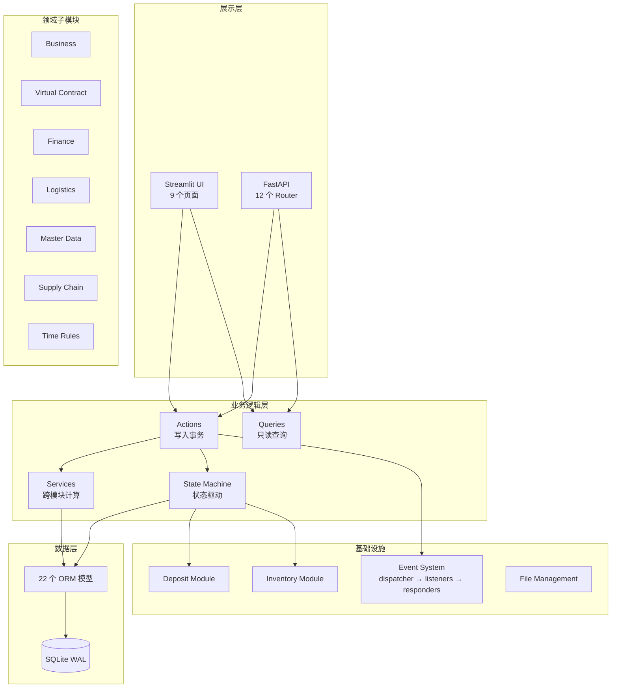

# ShanYinERP-v4 项目全面 Review 报告

> 审查日期：2026-03-21 | 审查范围：全部 112 个 Python 文件，约 1MB 源码

---

## 📊 项目概览

| 维度 | 数据 |
|------|------|
| 技术栈 | Python 3.13 + Streamlit + FastAPI + SQLAlchemy + SQLite |
| 源文件 | 112 个 .py 文件，约 1,026 KB |
| 测试 | **154 通过 / 7 失败 / 7 xfailed**（通过率 **95.7%**） |
| 数据模型 | 22 个 ORM 模型 |
| 业务子模块 | 7 个领域包（business/vc/finance/logistics/master/supply_chain/time_rules） |
| API 路由 | 12 个 FastAPI Router |
| UI 页面 | 9 个 Streamlit 页面 |

---

## ✅ 架构优势

### 1. 领域模型设计出色

核心业务抽象为 [VirtualContract](file:///d:/WorkSpace/ShanYin/ShanYinERP-v4/models.py#107-193)（虚拟合同）驱动的全流程管理：

```
Business → VirtualContract → Logistics + CashFlow → FinancialJournal
```

- **VirtualContract** 是系统核心聚合根，统一了采购/供应/退货等多种业务类型
- 三维状态机（[status](file:///d:/WorkSpace/ShanYin/ShanYinERP-v4/models.py#176-181) / [subject_status](file:///d:/WorkSpace/ShanYin/ShanYinERP-v4/models.py#182-187) / [cash_status](file:///d:/WorkSpace/ShanYin/ShanYinERP-v4/models.py#188-193)）设计精巧，可独立跟踪标的进度与资金进度
- 状态变更内嵌事件发布（[models.py:144-174](file:///d:/WorkSpace/ShanYin/ShanYinERP-v4/models.py#L144-L174)），确保审计可追溯

### 2. 架构分层清晰

```
UI 层 (Streamlit)
    ↓ 调用
Logic 层 (actions → services → state_machine → models)
    ↓ 并行
API 层 (FastAPI，面向 AI Agent)
```

每个领域子模块统一为 `actions/queries/schemas` 三件套，职责边界清晰：
- `actions`：写入操作（事务边界）
- `queries`：只读查询（无副作用）
- `schemas`：数据验证（Pydantic）

### 3. 事件驱动架构（EDA）初步成型

- [SystemEvent](file:///d:/WorkSpace/ShanYin/ShanYinERP-v4/models.py#L419-L428) 模型持久化所有领域事件
- [dispatcher.py](file:///d:/WorkSpace/ShanYin/ShanYinERP-v4/logic/events/dispatcher.py) → [listeners.py](file:///d:/WorkSpace/ShanYin/ShanYinERP-v4/logic/events/listeners.py) → [responders.py](file:///d:/WorkSpace/ShanYin/ShanYinERP-v4/logic/events/responders.py) 三层解耦
- 内置两个响应器：物流完成自动触发时间规则 + 库存低水位预警

### 4. 时间规则引擎

[time_rules](file:///d:/WorkSpace/ShanYin/ShanYinERP-v4/logic/time_rules) 是独立的合规监控子系统：
- 支持触发/目标事件配对 + 偏移量约束
- 多级告警（绿/黄/橙/红）
- 规则继承体系（自定制 > 近继承 > 远继承）
- 总代码量近 90KB，功能完备

### 5. 数据管理成熟

- Excel 批量导入导出（[file_mgmt.py](file:///d:/WorkSpace/ShanYin/ShanYinERP-v4/logic/file_mgmt.py)），670行，带 INDIRECT 级联下拉、条件格式、工作表保护
- SQLite WAL 模式 + busy_timeout，支持 Streamlit + FastAPI 并发
- 完整的索引优化（[EquipmentInventory](file:///d:/WorkSpace/ShanYin/ShanYinERP-v4/models.py#57-81)、[VirtualContract](file:///d:/WorkSpace/ShanYin/ShanYinERP-v4/models.py#107-193)、[CashFlow](file:///d:/WorkSpace/ShanYin/ShanYinERP-v4/models.py#343-377) 表均有复合索引）

---

## ⚠️ 需要关注的问题

### 🔴 高优先级

#### 1. [ui/operations.py](file:///d:/WorkSpace/ShanYin/ShanYinERP-v4/ui/operations.py) 文件过大（135KB / 约 3500+ 行）

这是当前项目最大的技术债务。该文件承载了虚拟合同管理、库存看板、业务管理、供应链管理等几乎所有运营类 UI 的渲染逻辑。

**建议**：按功能拆分为独立模块：
- `ui/vc_management.py`：虚拟合同页面
- `ui/inventory.py`：库存看板
- `ui/business.py`：业务管理
- `ui/supply_chain.py`：供应链管理

#### 2. [logic/actions.py](file:///d:/WorkSpace/ShanYin/ShanYinERP-v4/logic/actions.py) 兼容层存在悬挂引用

```python
# 第 101 行：__all__ 中列出了 create_express_order_action 但未导入
'create_express_order_action',
# 第 117-118 行：__all__ 中列出了这些但未定义
'update_supply_chain_action',
'delete_supply_chain_action',
```

这些导出名实际不存在，任何使用 `from logic.actions import *` 或显式导入都会 `ImportError`。

#### 3. 测试失败需修复（7 个）

关键失败项：
- `test_update_vc_not_found`：API 返回 500 而非预期的 200/404
- `test_finance_queries_no_session_param`：`get_dashboard_stats` 函数签名不符合无 session 参数规范

### 🟡 中优先级

#### 4. Session 管理存在潜在泄露风险

[main.py 第 149 行](file:///d:/WorkSpace/ShanYin/ShanYinERP-v4/main.py#L148-L205) [handle_global_dialogs()](file:///d:/WorkSpace/ShanYin/ShanYinERP-v4/main.py#148-206) 中：

```python
session = get_session()
# ... 多处 del st.session_state[key] 后调用弹窗
session.close()
```

如果弹窗函数内部抛出异常，`session.close()` 可能永远不会执行。建议使用 `try/finally` 或 context manager。

#### 5. 大量 `DEBUG: print()` 残留

[deposit.py](file:///d:/WorkSpace/ShanYin/ShanYinERP-v4/logic/deposit.py) 和 [inventory.py](file:///d:/WorkSpace/ShanYin/ShanYinERP-v4/logic/inventory.py) 中散布大量 `print(f"DEBUG: ...")` 调试语句，应替换为 `logging` 模块或移除。

#### 6. `datetime.now` 作为默认值的陷阱

多个模型中使用 `default=datetime.now`（不带括号），这在 SQLAlchemy 中是正确的（作为 callable），但容易引起误解。建议统一为注释说明或使用 `server_default`。

#### 7. `.tmp` 文件残留

`logic/` 目录下存在临时文件未清理：
- [logic/actions.py.tmp.2940.1773892267355](file:///d:/WorkSpace/ShanYin/ShanYinERP-v4/logic/actions.py.tmp.2940.1773892267355)
- [logic/actions.py.tmp.2940.1773892363647](file:///d:/WorkSpace/ShanYin/ShanYinERP-v4/logic/actions.py.tmp.2940.1773892363647)
- [logic/file_mgmt.py.tmp.2940.1773892497634](file:///d:/WorkSpace/ShanYin/ShanYinERP-v4/logic/file_mgmt.py.tmp.2940.1773892497634)

### 🟢 低优先级 / 建议

#### 8. [requirements.txt](file:///d:/WorkSpace/ShanYin/ShanYinERP-v4/requirements.txt) 中不必要的依赖

`flask-sqlalchemy>=3.1.0` 被列为依赖，但项目中未使用 Flask（前端是 Streamlit，API 是 FastAPI），建议移除。

#### 9. 常量使用字符串类 vs Enum

[constants.py](file:///d:/WorkSpace/ShanYin/ShanYinERP-v4/logic/constants.py) 定义了大量常量类（[VCType](file:///d:/WorkSpace/ShanYin/ShanYinERP-v4/logic/constants.py#109-116)、[VCStatus](file:///d:/WorkSpace/ShanYin/ShanYinERP-v4/logic/constants.py#117-122) 等），但使用的是普通 `class` + 字符串属性而非 Python `Enum`。当前方式可以工作，但不能类型检查或防止拼写错误。长远来看使用 `StrEnum` 更安全。

#### 10. 合同附件路径硬编码

[file_mgmt.py 第 649 行](file:///d:/WorkSpace/ShanYin/ShanYinERP-v4/logic/file_mgmt.py#L649)：

```python
CONTRACT_DIR = "data/contracts"
```

建议提取到配置文件或环境变量。

#### 11. API Router 缺少权限控制

当前 FastAPI 通过 CORS `allow_origins=["*"]` 完全放开，也没有任何认证中间件。对于内网单机部署可以接受，但如果未来暴露到公网需要增加 Auth。

---

## 🧪 测试覆盖分析

| 测试类别 | 文件数 | 状态 |
|----------|--------|------|
| 状态机 ([test_state_machine.py](file:///d:/WorkSpace/ShanYin/ShanYinERP-v4/tests/test_state_machine.py)) | 1 | ✅ 全通过 |
| 押金模块 ([test_deposit.py](file:///d:/WorkSpace/ShanYin/ShanYinERP-v4/tests/test_deposit.py)) | 1 | ✅ 全通过 |
| 事件系统 ([test_events.py](file:///d:/WorkSpace/ShanYin/ShanYinERP-v4/tests/test_events.py)) | 1 | ✅ 全通过 |
| 时间规则 ([test_time_rules.py](file:///d:/WorkSpace/ShanYin/ShanYinERP-v4/tests/test_time_rules.py)) | 1 | ✅ 全通过 |
| UI 重构合规 (`test_ui_refactoring*.py`) | 2 | ✅ 全通过 |
| API 路由 (`tests/api/`) | 多个 | ⚠️ 1 失败 |
| 查询接口 (`tests/queries/`) | 多个 | ⚠️ 1 失败 |
| Action 边界 (`tests/actions/`) | 多个 | ⚠️ 部分失败 |

**综合通过率：95.7%**，核心业务逻辑（状态机、押金、事件、时间规则）**100% 通过**。

---

## 📐 架构图



---

## 💡 改进建议优先级排序

| 优先级 | 改进项 | 工作量 | 影响 |
|--------|--------|--------|------|
| 🔴 P0 | 拆分 `ui/operations.py`（135KB） | 2-3 天 | 极大提升可维护性 |
| 🔴 P0 | 修复 `logic/actions.py` 的悬挂导出 | 30 分钟 | 消除潜在 ImportError |
| 🔴 P0 | 修复 7 个失败测试 | 1-2 小时 | 恢复 CI 绿灯 |
| 🟡 P1 | Session 管理加 try/finally | 1 小时 | 防止连接泄露 |
| 🟡 P1 | 清理 DEBUG print 语句 | 30 分钟 | 代码整洁 |
| 🟡 P1 | 清理 .tmp 临时文件 | 5 分钟 | 仓库干净 |
| 🟢 P2 | 移除 flask-sqlalchemy 依赖 | 5 分钟 | 依赖精简 |
| 🟢 P2 | 常量类改用 StrEnum | 2-3 小时 | 类型安全 |
| 🟢 P2 | 路径配置外部化 | 1 小时 | 部署灵活 |

---

## 🏆 总体评价

这是一个**设计良好、功能完备的中型 ERP 系统**。核心亮点：

1. **业务建模深度高**：VirtualContract 三维状态机 + 押金分摊 + 退货穿透 + 财务复式记账，体现出对饮品设备运营领域的深刻理解
2. **架构演进方向正确**：已完成从"单文件"到"领域子模块"的重构，事件驱动架构初步成型
3. **面向 AI 的前瞻设计**：SystemEvent 表 + `pushed_to_ai` 字段 + 标准化事件类型，为 AI Agent 接入做好了管道准备
4. **测试意识好**：核心业务逻辑 100% 测试覆盖，整体通过率 95.7%

主要短板集中在 **UI 层代码组织**（operations.py 过大）和一些工程细节（调试日志清理、兼容层悬挂引用等），均可在 1-2 周内解决。

> **Overall Score: 8/10** — 业务完成度高，架构合理，待持续重构 UI 层即可进入下一阶段演进。
