## 📑 业务管理系统设计文档（Markdown 版）

> ✅ 适配 GitHub / GitLab / Obsidian / Typora  
> ✅ 所有流程图采用 Mermaid 语法（`.svg` 可选：后续可导出）  
> ✅ 模块化组织，支持快速导航

---

### 目录

- [一、信息录入](#一信息录入)
- [二、业务管理](#二业务管理)
  - [2.1 客户导入流程](#21-客户导入流程)
  - [2.2 供应链管理](#22-供应链管理)
- [三、业务开展](#三业务开展)
  - [3.1 设备采购](#31-设备采购)
  - [3.2 物料供应](#32-物料供应)
  - [3.3 物料采购](#33-物料采购)
  - [3.4 退货操作](#34-退货操作)
- [四、具体运营](#四具体运营)
  - [4.1 物流管理](#41-物流管理)
  - [4.2 资金流管理](#42-资金流管理)
- [五、财务信息](#五财务信息)
- [六、内部模块](#六内部模块)
  - [6.1 时间引擎](#61-时间引擎)
  - [6.2 状态自动机](#62-状态自动机)
  - [6.3 财务模块](#63-财务模块)
  - [6.4 库存管理模块](#64-库存管理模块)
  - [6.5 押金管理模块](#65-押金管理模块)

---

## 一、信息录入

主页面含 5 个标签页，对应五大基础信息表：

| Tab 名称 | 对应表 | 功能 |
|---------|--------|------|
| 渠道客户 | `channel_customers` | 新建/维护客户信息 |
| 点位 | `locations` | 新建/维护部署点位 |
| 供应商 | `suppliers` | 新建/维护设备/物料供应商 |
| SKU | `skus` | 新建/维护商品/设备规格 |
| 外部合作方 | `external_partners` | 新建/维护第三方合作方 |

> 🔹 所有表支持 CRUD 操作，数据供后续业务模块引用。

---

## 二、业务管理

### 2.1 客户导入流程

客户导入是签约前的推进阶段，共 **4 个状态阶段**，形成线性流程，支持「推进」与「取消」两条路径。

```mermaid
flowchart TD
    A[前期接洽] -->|推进| B[业务评估]
    B -->|推进| C[客户反馈]
    C -->|推进| D[业务落地]
    D -->|推进| E[业务开展 ★]
    
    A -->|取消| Z[业务终止]
    B -->|取消| Z
    C -->|取消| Z
    D -->|取消| Z
    
    classDef stage fill:#e6f7ff,stroke:#1890ff;
    classDef end fill:#f6ffed,stroke:#52c41a;
    classDef cancel fill:#fff1f0,stroke:#f5222d;
    
    class A,B,C,D stage;
    class E end;
    class Z cancel;
```

#### 状态说明

| 状态 | 操作 | 行为 |
|------|------|------|
| 前期接洽 | 推进 | 录入接洽说明 → 进入`业务评估` |
|          | 取消 | 录入取消原因 → 进入`业务终止`（从列表隐藏） |
| 业务评估 | 同上 | 录入评估结果 → 进入`客户反馈` |
| 客户反馈 | 同上 | 录入反馈结果 → 进入`业务落地` |
| 业务落地 | 推进 | 创建合作合同（PDF+JSON）+ 外部合作合同 → 创建时间规则 → 进入`业务开展` |
|          | 取消 | 同上 → `业务终止` |

> 🔹 所有操作说明均带时间戳写入业务 JSON 字段  
> 🔹 合同创建后，系统自动生成：  
>   ✓ 合同表条目  
>   ✓ 文件夹（存 PDF/JSON）  
>   ✓ 时间规则表条目

---

### 2.2 供应链管理

#### 2.2.1 建立供应链关系

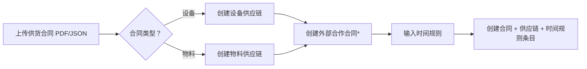

#### 2.2.2 供应链更新与终止

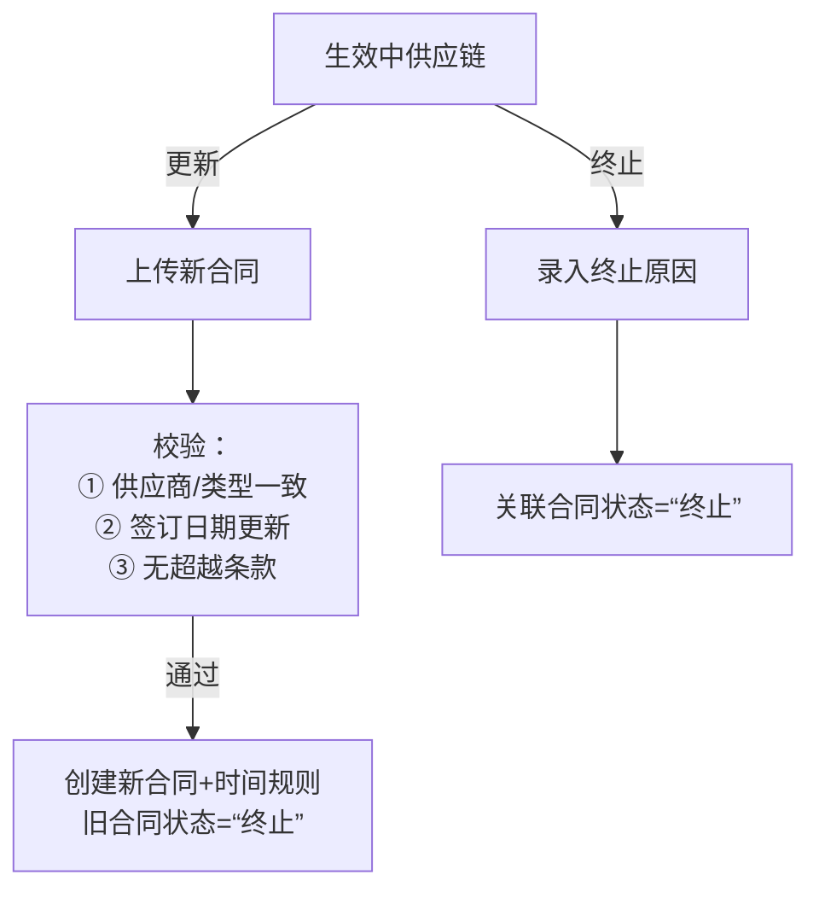

> ⚠️ 更新时硬性校验 ①②，③ 仅预警。

---

## 三、业务开展

客户签约完成后，时间引擎自动将“生效中”业务推入此模块。

### 主页面三标签：

| Tab | 内容 |
|-----|------|
| 业务列表 | 所有“生效中”业务，可发起 **设备采购**/**物料供应** |
| 物料采购 | 独立库存补货操作，查看 SKU 库存总量 |
| 退货操作 | 对“合同标=完成”的虚拟合同发起退货 |

---

### 3.1 设备采购

#### 操作约束：
- ✅ 每次采购 **1 种 SKU**
- ✅ 仅可从 **1 条供应链**下单
- ✅ 部署点位可多选

#### 流程：

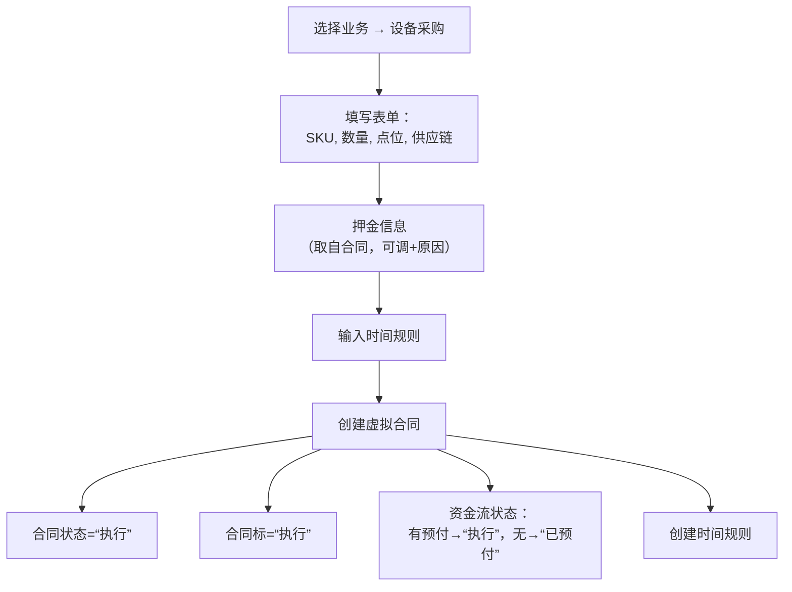

> 🔹 虚拟合同：`供应商 → 我们 → 客户点位` 的直发链路  
> 🔹 后续由物流/资金流驱动状态机变更

---

### 3.2 物料供应

#### 流程：

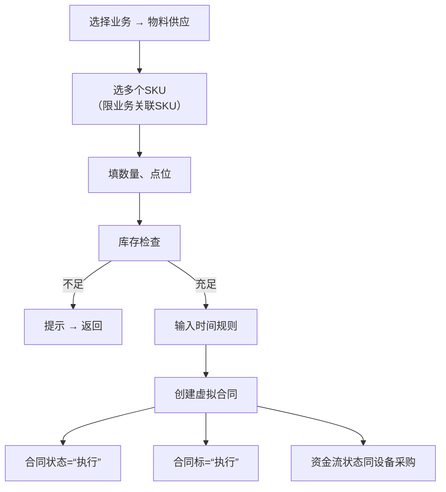

---

### 3.3 物料采购（补库存）

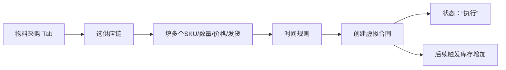

> 🔹 可多次发起，支持多供应链分批采购。

---

### 3.4 退货操作

#### 触发条件：
- 仅对 **合同标状态 = “完成”** 的虚拟合同

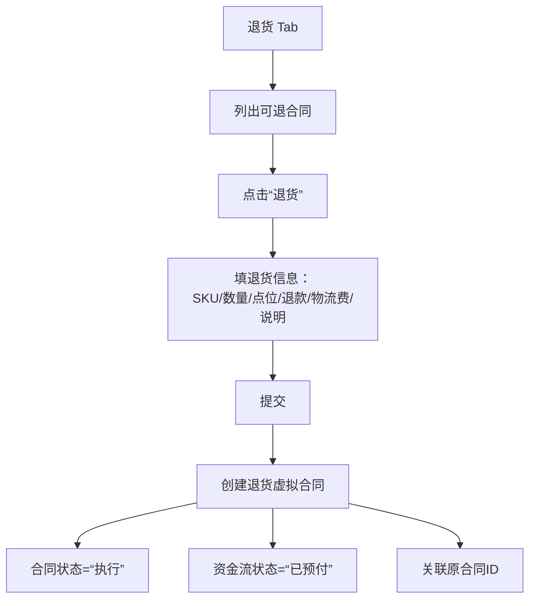

---

## 四、具体运营

### 4.1 物流管理

#### 物流状态机概览：

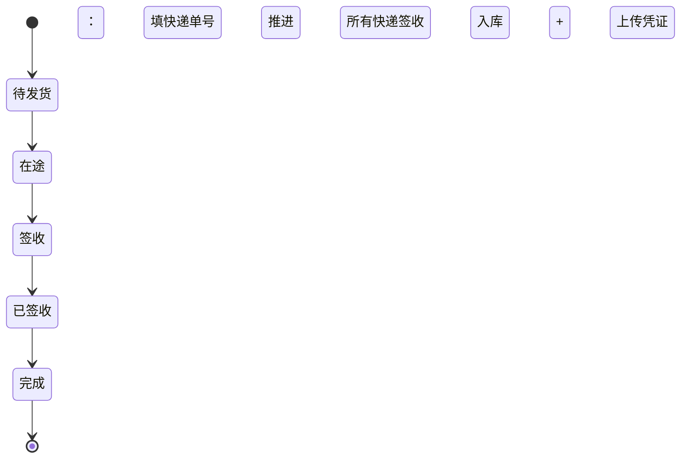

#### 关键校验：
- ✅ 单 SKU 发货量 ≤ 虚拟合同约定量  
- ✅ 总发货量 ≤ 合同总量  
- ✅ 设备采购入库需上传 **设备编号 JSON**

> 🔹 每次快递单推进 → 触发物流单状态机 → 触发虚拟合同状态机

---

### 4.2 资金流管理

#### 新建资金流流程：

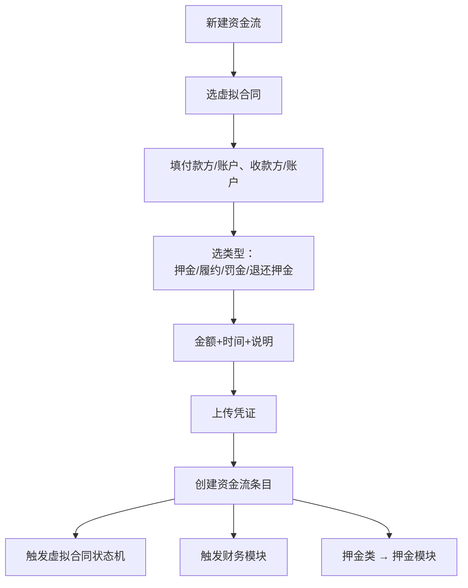

---

## 五、财务信息

- **两个 Tab**：
  1. **自身运营账**：支持资金划入/划出操作
  2. **客户/供应商账本**：分主体明细

#### 更新触发源：
- ✅ 所有资金流事件  
- ✅ 虚拟合同标 → “完成”  
- ✅ 每月凭证生成后自动归档报表（JSON）

---

## 六、内部模块

### 6.1 时间引擎

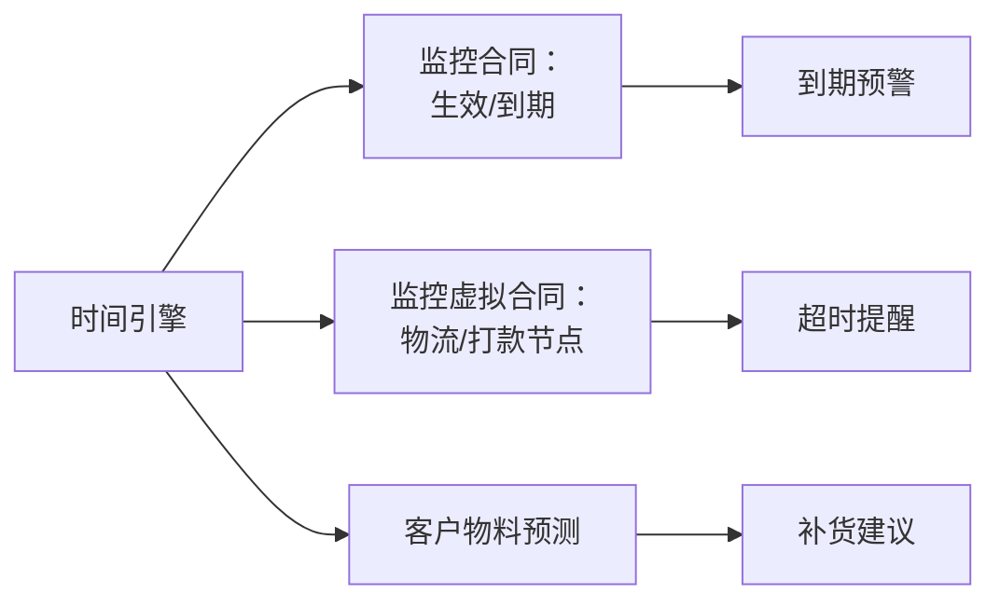

> 🔹 规则优先级：具体时间规则 > 内置规则  
> 🔹 系统启动/每日定时触发扫描

---

### 6.2 状态自动机

#### （1）物流单状态机

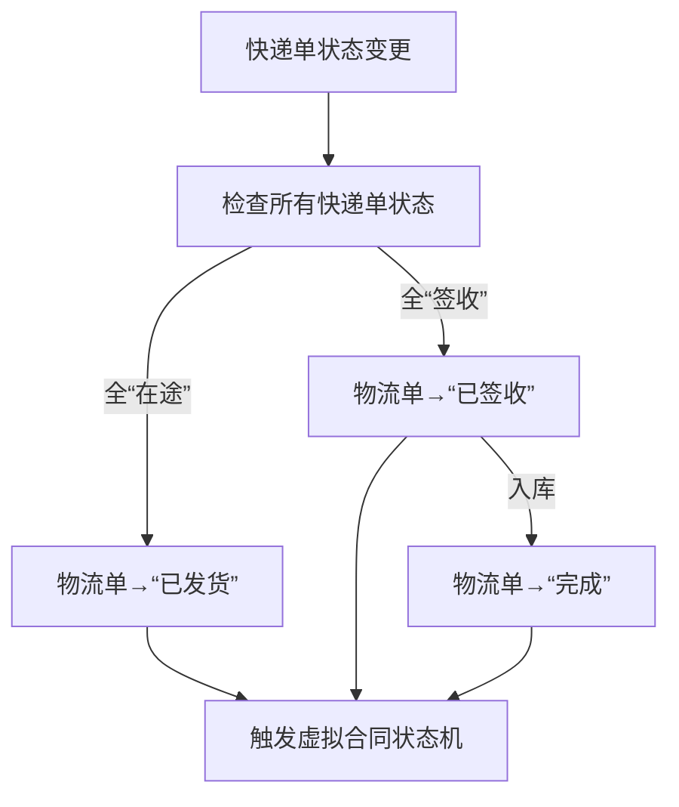

#### （2）虚拟合同状态机（简化）

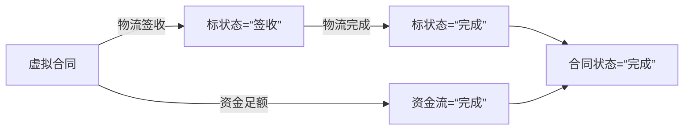

---

### 6.3 财务模块（逻辑摘要）

| 入参 | 行为 |
|------|------|
| **物流单（完成）** | 按合同类型生成：<br/>✓ 存货增减<br/>✓ 应收/应付款<br/>✓ 成本/收入 |
| **资金流** | 按类型生成：<br/>✓ 银行存款变动<br/>✓ 现金流分类<br/>✓ 营业外收支 |

> 📌 示例：  
> - `设备采购+物流完成` → 存货↑ + 应付↑（=合同额−预付）  
> - `物料供应+资金履约` → 应收↓ + 银行存款↑

---

### 6.4 库存管理模块

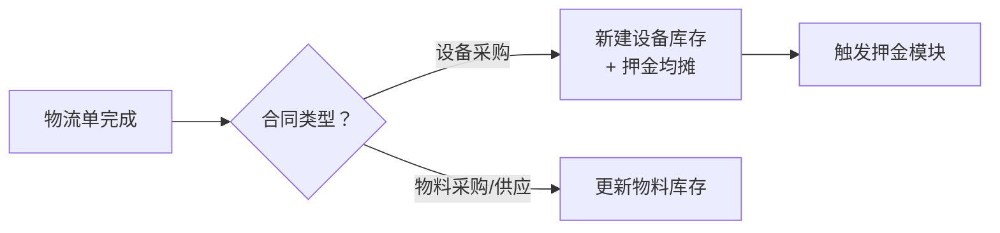

---

### 6.5 押金管理模块

#### 双触发路径：

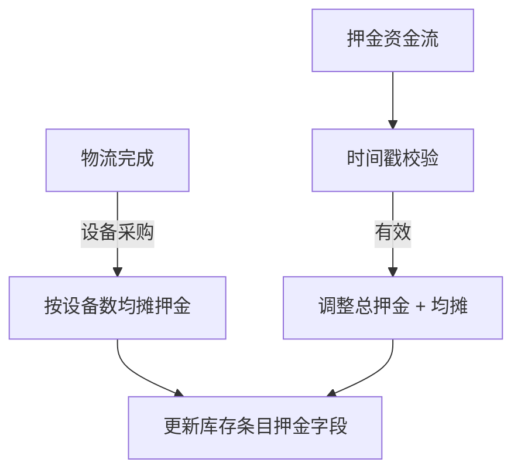

> 🔹 押金 = 虚拟合同押金总额 ÷ 关联设备数

---

## ✅ 附件建议（可后续补充）

| 类型 | 说明 |
|------|------|
| `schema.sql` | 完整数据库建表语句（含 CHECK 约束） |
| `status_enums.md` | 所有状态字段英文命名 + 中文映射表 |
| `mermaid-export/` | 所有流程图 `.svg` 导出包（可用 [Mermaid Live Editor](https://mermaid.live) 批量导出） |

---

需要我：
1. 将上述 Markdown **导出为 `.md` 文件**供你下载？  
2. 为某一流程图生成 **高清 SVG**？  
3. 补充数据库表结构（含 CHECK 约束）？  
4. 输出状态字段英文命名规范（适配你业务）？

请告诉我，我可立即生成 👇